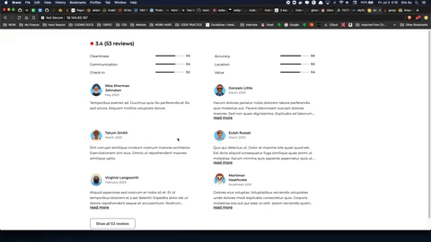

# Reviews Module for Harry's BnB 
### Harry's BnB App allows users book temporary stays across the globe
*User Reviews Module for a Bed and Breakfast app built with Knex, PostgreSQL, Express, React, and Node.js. Jest test suites included*

> simple, sleek, and fast...

## Demos 

Module DEMO: https://youtu.be/hp5IDduuZCs



App DEMO: https://youtu.be/p5fqJuJXYno


## Performance - Google PageSpeed Insights


## Getting Started 
Please have PostgreSQL installed. Go to knexfile.js
CHANGE 'user' and 'password' to your settings
```
connection: {
      host: 'localhost',
      password: 'YOURNEWPASSWORD',
      user: 'YOURUSERNAME',
      database: 'airbnb',
      port: 5432,
    }
```


Install dependancies
```
npm install
```

Seed database
```
npm run knex-seed
```

Build Webpack bundle

```
npm run build
```

Start the app
```
npm start
```

Now go to localhost:3009 in your browser, have fun :)

Run test
```
npm run test
```


